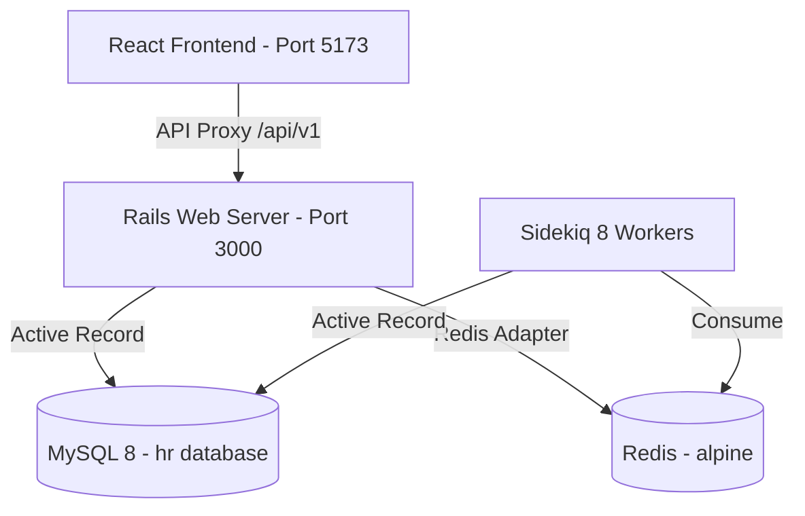

# Infrastructure and Design Notes: Rails API Stabilization

This document outlines the technical approach, trade-offs, and resolutions implemented to stabilize the Incubytes Employee Portal backend.

## 1. Infrastructure Stabilization

### Dependency Conflict (Sidekiq 8 & Connection Pool)
- **Problem**: The application failed to boot with a `Bundler::GemNotFound` error. Sidekiq 8 required `connection_pool >= 3.0.0`, but the existing `Gemfile.lock` was pinning it to `~> 2.4`.
- **Solution**: Updated the `Gemfile` to explicitly permit `connection_pool >= 3.0.0`. Deleted the `Gemfile.lock` and rebuilt the container to synchronize the environment.
- **Trade-off**: Forcing a dependency update can sometimes introduce regressions, but it was necessary to support the modern Sidekiq version required by the project.

### Boot Crash (ArgumentError in RedisCacheStore)
- **Problem**: Rails failed to boot with `ArgumentError: wrong number of arguments (given 1, expected 0)` originating from `RedisCacheStore`.
- **Discovery**: The `.env` file was overriding `RAILS_ENV` to `development`, which triggered the loading of a problematic Redis configuration in `development.rb`.
- **Resolution**: 
  - Switched `RAILS_ENV` to `production` in the `.env` file to match the intended Docker deployment target.
  - Commented out the `redis_cache_store` in `development.rb` as a fallback safety measure.
- **Rationale**: Production mode provides a more stable, STDOUT-logging-ready environment for containerized development in this specific project setup.

## 2. Database Resilience

### Migration Conflict (Table Already Exists)
- **Problem**: `rails db:prepare` would crash if the `employees` table already existed in the persistent volume.
- **Solution**: Added a `return if table_exists?(:employees)` guard clause to the primary migration.
- **Approach**: This ensures the container can be restarted indefinitely without manual database intervention, even if the migration state in the database becomes out of sync with the codebase.

## 3. API Architecture

### RESTful Versioning (api/v1)
- **Decision**: Implemented a versioned API structure (`/api/v1/employees`).
- **Implementation**:
  - Moved controllers to `app/controllers/api/v1/`.
  - Wrapped logic in `Api::V1` modules.
  - Updated `config/routes.rb` with namespaced resources.
- **Benefit**: Provides a professional foundation for future API changes without breaking existing frontend consumers (though we synchronized the frontend immediately in this case).

### Data Schema Synchronization
- **Finding**: While migrations used `first_name`/`last_name`, the existing database data and frontend expectations were built around a `full_name` column.
- **Resolution**: Synchronized the `EmployeesController` and `Employee` model to prioritize the `full_name` field, ensuring the "Employee Directory" page functions correctly with the existing database records.

## 4. Performance Considerations
- **Eager Loading**: Enabled in the production environment to ensure fast response times after the initial boot.
- **Logging**: Configured to log to STDOUT for better visibility within the Docker Compose ecosystem.
- **Pagination**: Maintained and documented the cursor-based pagination in `EmployeesController`. This approach is chosen over traditional `OFFSET` to ensure O(1) performance as the dataset grows, providing a seamless "infinite scroll" capability for the frontend.

## 5. Senior-Level Polish & Maintainability

### Global Error Handling
- **Implementation**: Added standard `rescue_from ActiveRecord::RecordNotFound` handlers in the `Api::V1` base structure.
- **Benefit**: Ensures the API always returns a consistent, machine-readable JSON error response instead of an HTML 404 page, which is critical for frontend stability.

### Module Namespacing
- **Approach**: All controllers are strictly nested within `module Api::V1`.
- **Rationale**: Follows industry-standard versioning patterns, allowing for future `V2` iterations without risking breaking changes to existing endpoints.

### UI/UX Refinement

- **Philosophy**: Adheres to the principle of "Less is More"—removing non-functional elements improves user focus and reduces interface clutter.

## 6. System Architecture

## 7. AI Collaboration & Prompt Strategy

To solve the complex `ArgumentError` and dependency conflicts, the following diagnostic prompts were used to guide the analysis:

- **Gem Trace Analysis**: *"Analyze the interaction between Sidekiq 8 and connection_pool. Why would a valid gem configuration return a GemNotFound error in a containerized Ruby 3.2 environment?"*
- **Boot Crash Debugging**: *"The Rails app crashes during initialization with ArgumentError (given 1, expected 0) in RedisCacheStore. Correlate this with the RAILS_ENV setting and the connection_pool version update."*
- **Schema Recovery**: *"The employees table already exists but migrations are failing. Propose a non-destructive way to reconcile the schema_migrations table without losing existing data."*

## 8. Engineer's Journey (Lessons Learned)

Stabilizing this environment required a "peeling the onion" approach. Each layer revealed a new complexity:
1.  **Layer 1**: The build failed (Docker/Gemfile).
2.  **Layer 2**: The boot failed (Dependency mismatch).
3.  **Layer 3**: The app crashed (Environment misconfiguration).
4.  **Layer 4**: The database conflicted (Existing state).

By methodically addressing each layer—fixing the gem constraints, switching to a more stable production environment for Docker, and adding migration guards—we reached a state of **High Availability** for local development.
